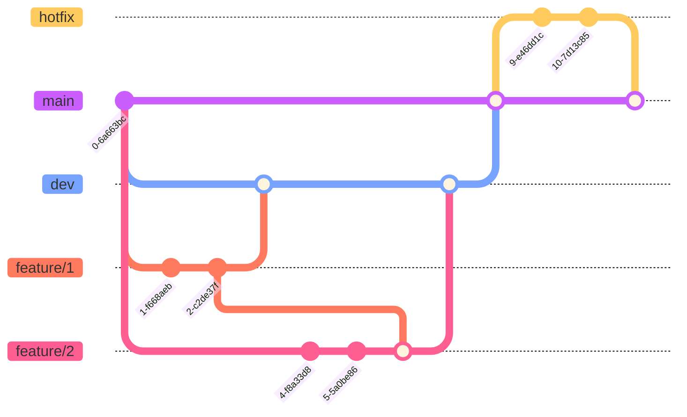

<h2 align="center"> CO4029 Sem 231 - Specialized Project </h2>

### Project Title:   Design and Implementation of a Low-Code Platform for Promotion Campaign Automation: A Business Process Approach

  <a href="#project-overview">Overview</a> |
  <a href="#project-goals">Goals</a> |
  <a href="#work-phases"> Phases</a> |
  <a href="#project-timeline">Timeline</a> |
  <a href="#project-layout">Project layout</a>

## Project Overview

This project is a low-code platform for promotion campaign automation. It includes a web application GUI that allows users (*e.g marketing team*) to create and manage promotion campaigns. This platform will be designed as a **microservice** to integrate seamlessly with various products and platforms, accommodate dynamic business needs, and improve user experience while ensuring efficient operational cost, data security, and flexible deployment options.

The project is developed as part of the **CO4029 Sem 231 - Specialized Project** module at the Ho Chi Minh City University of Technology.

### Project Justification

In the current digital age, businesses are increasingly relying on automation to streamline their processes and improve efficiency. Current major platforms such as Gojek and Lazada relies heavily on promotion campaigns to attract customers. These campaigns are need to be able to serve a large number of customers at the same time, and are often time-sensitive. Therefore, the process of creating and managing these campaigns need to be fast and efficient. 
 
Therefore, promotion campaigns, being a critical aspect of marketing, can greatly benefit from automation. The use of a low-code platform can simplify the process of managing these campaigns, allowing non-technical users to contribute effectively and reducing the development time and cost.

## Work Phases

- [ ] [Research Phase](./documentation/research/README.md): This phase involves researching existing low-code platforms, understanding their strengths and weaknesses, and identifying features that would be beneficial for managing promotion campaigns.

- [ ] *W.I.P*

## Project Goals

The expected outcome of this project is a functional low-code platform that simplifies and automates the management of promotion campaigns. It should provide a user-friendly interface, seamless data integration, robust security features, and flexible deployment options. The platform should be adaptable to changing business needs and scalable to handle varying volumes of promotion campaigns.

### Metrics for Evaluation

## Project Timeline

## Project Layout
 
- [Documentation](./documentation/README.md)

## Git Branching Strategy

