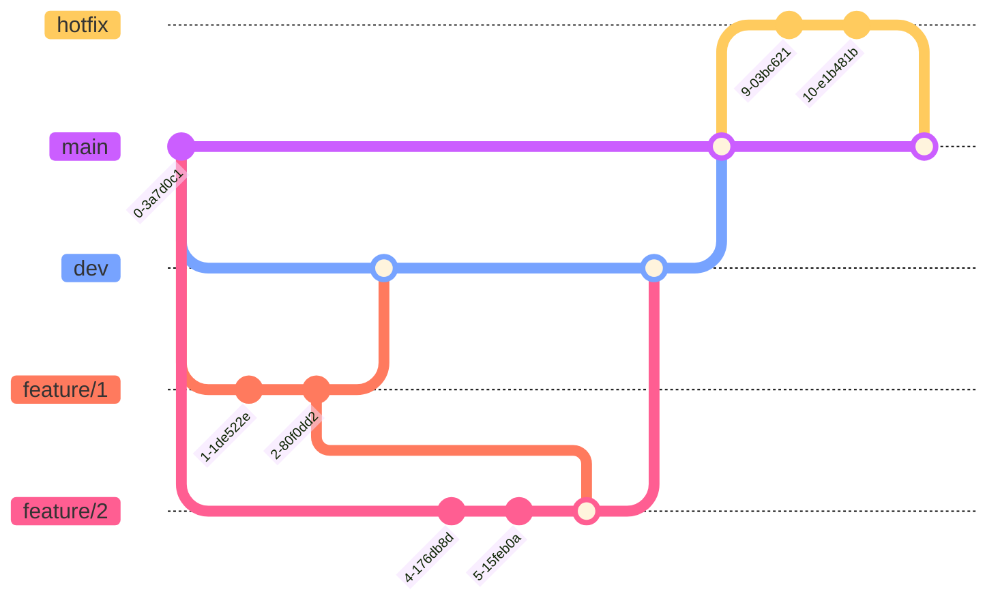

# Methodology

***

- [Description of the development methodology employed](#development-methodology)
- [Overview of the technologies, tools, and frameworks used](#technologies-tools-and-frameworks)

***

## Development Methodology

- [Development Approach](#development-approach)
- [Task Management](#task-management)
- [Version Control](#version-control)

### Developement Approach

The project's development approach is based on the Agile methodology, but does not follow strictly to any existing framework. Some of the main principles of the Agile methodology that will be followed are:

- Each team member shares the same responsibilities and has the same authority.
- The team is self-organizing and self-managing.
- The team is cross-functional and has all the skills necessary to complete the project.
- The team is self-sufficient and does not rely on external resources.

The project will be divided into multiple iterations, which will have a duration of 1 week. Each iteration will have a set of tasks to be completed, and at the end of each iteration, the team will deliver a working product increment. The product increment will be reviewed and evaluated by the team and the advisors, and the feedback will be used to improve the product in the next iteration.
### Task Management

Task management is done using GitHub Projects. The project is divided into multiple iterations, each of which is represented by a GitHub Project board. Each iteration board is divided into 4 columns: `To do`, `In progress`, `Review`, and `Done`. Each task is represented by a GitHub Issue, which is then added to the corresponding column on the board. The team members will then move the tasks between the columns as they progress through the iteration.

### Version Control

Version control of the project is done using Git and GitHub. The project repository is hosted on GitHub and is accessible at [link](https://github.com/users/nguyendhst/projects/1). 

To work on the project, a Git branching model convention is used. The model is as follows:

- **Main branch**: `main` - The main branch is the branch where the source code of HEAD always reflects a production-ready state.

- **Development branch**: `dev` - The development branch is the branch where the source code of HEAD always reflects a state with the latest delivered development changes for the next release. Some would call this the “integration branch”. This is where any automatic nightly builds are built from.

- **Feature branch**: `feature/1` - Feature branches (or sometimes called topic branches) are used to develop new features for the upcoming or a distant future release. When starting development of a feature, the target release in which this feature will be incorporated may well be unknown at that point. The essence of a feature branch is that it exists as long as the feature is in development, but will eventually be merged back into develop (to definitely add the new feature to the upcoming release) or discarded (in case of a disappointing experiment).

- **Hotfix branch**: `hotfix` - Hotfix branches are very much like release branches in that they are also meant to prepare for a new production release, albeit unplanned. They arise from the necessity to act immediately upon an undesired state of a live production version. When a critical bug in a production version must be resolved immediately, a hotfix branch may be branched off from the corresponding tag on the master branch that marks the production version.

## Technologies, Tools, and Frameworks