# Research Phase

## Table of contents
1. [Domain knowledge](#domain-knowledge)
    1. [Promotion campaign](#promotion-campaign)
	2. [Business process](#business-process)
2. [Low-code platform](#low-code-platform)
	1. [Existing low-code platforms](#existing-low-code-platforms)
3. [References](#references)

## Domain knowledge
### Promotion campaign

A promotion campaign is a marketing strategy to publicize a product, service, or business through various mediums to increase awareness and sales. It involves carefully planned strategies and tactics, including choosing target audiences, setting campaign objectives, designing promotional messages, and selecting promotional mix elements.

Some methods of this process contain an offer, coupon discounts, free sample distribution, trial offer, buy two items in the price of one, contest, festival discounts, etc. The promotion of a product is important to help companies improve their sales because customers reaction towards discounts and offers are impulsive. In other words, promotion is a marketing tool that involves enlightening the customers about the goods and services offered by an organization. [1](https://byjus.com/commerce/what-is-promotion/)

#### Core domains of promotion campaign

- **Campaign**: Marketing teams can run promotion campaign which involves managing advertising messages, budgets, validity time and benefits for targeted segments of customers. For example: Buy 1 get 1 free, 50% discount for students this summer, etc.

- **Promotion offer**: User benefits such as discount percentage is considered as offers of the campaign. Such offers can be applied to a specific product or a group of products. For example: Discount 20% for all coffee products. Or can be accessed by a voucher code. For example: Extra 10% discount for students with voucher code: STUDENT10

- **Rule**: Each promotion offer has its own ToC (*Terms and Conditions*) that must be satisfied or complied with. In essence, these are business rules. For example, a voucher is only eligible for users who purchase coffee at a Highland Coffee store in HCMC in a business day. Hence, there are 3 conditions for this offer: 
	- Only applies for coffee, 
	- At Highland HCMC and 
	- Time bought must be between Monday-Friday.

- **Effect**: The effect of a promotion offer is the result of applying that offer to an order. For example: A customer buys 2 coffee products with a total price of 100,000 VND. If the promotion offer is 20% discount for all coffee products, the effect of this offer is 20,000 VND.

- **Customer Segmentation/Audience Targeting**: Targeting a specific group of customers to run a promotion campaign so that the suitable offer can be provided. For example: Targeting students to run a promotion campaign aimed at customer with limited budget.

- **Data source**: The data source is the source of data for the promotion campaign. It can be a database, a file, or an API. For example: A database of all customers, a file containing all orders, or an API that provides customer information.
<!--
- **Examples of promotion campaign**:

<table>
	<tr>
		<td>
			
		</td>
		<td>
			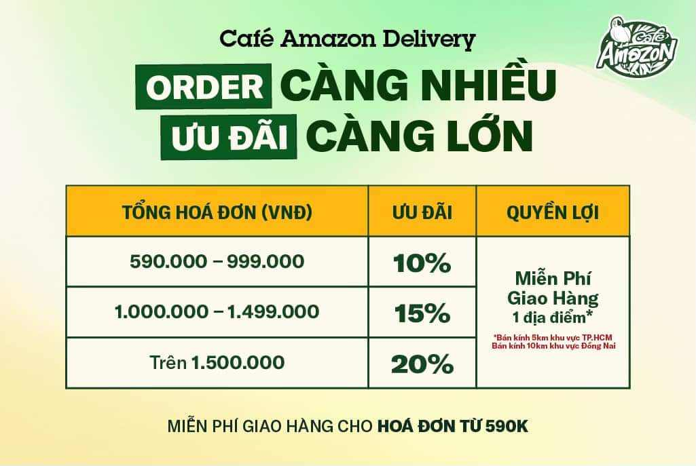
		</td>
	</tr>
	<tr>
		<td>
			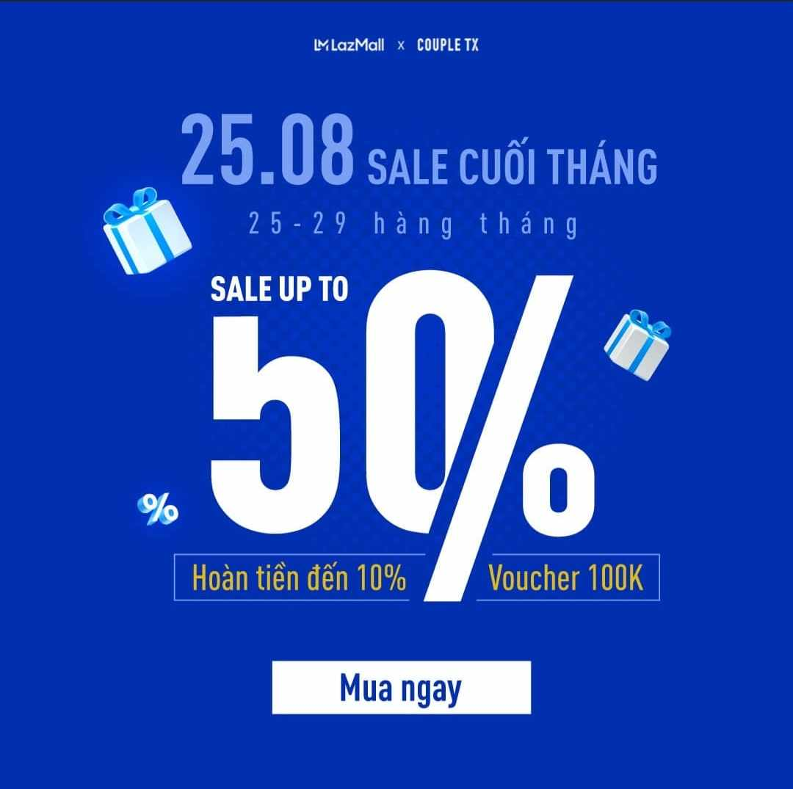
		</td>
		<td>
			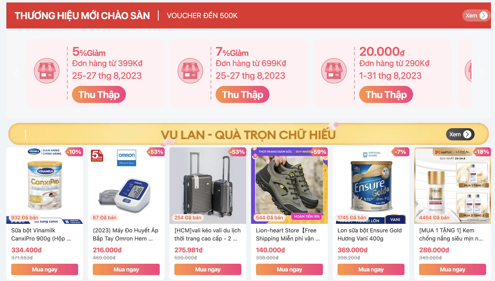
		</td>
	</tr>
</table>-->

## Business process automation

Business process automation (BPA) is the technology-enabled automation of complex business processes. It can streamline a business for simplicity, achieve digital transformation, increase service quality, improve service delivery or contain costs. It consists of integrating applications, restructuring labor resources and using software applications throughout the organization. Robotic process automation is an emerging field within BPA and uses artificial intelligence. [2](https://en.wikipedia.org/wiki/Business_process_automation)

## Low-code platform

Low-code platforms are a type of business process automation (BPA) software that enables developers of varied experience levels to create applications for web and mobile, using drag-and-drop components and model-driven logic through a graphic user interface (GUI). Low-code platforms can also connect to various data sources, systems, and services, and support different devices and platforms. Low-code platforms are designed to be user-friendly, flexible, and scalable, and to accelerate the development and delivery of applications and processes[3](https://en.wikipedia.org/wiki/Low-code_development_platform)

### Low-Code vs Traditional Coding

- Main difference: Low-code platforms use visual modeling to create applications, while traditional coding requires developers to write every line of code.

- Main advantage: Accelerate software development process. It allows developers to automate repetitive tasks. Non-technical users can also contribute to the application development process.
### Characteristics of low-code platform

- **Visual modeling**: Low-code platforms use visual modeling to create applications. This means that developers can drag and drop components into a canvas and connect them to create an application. This is in contrast to traditional coding, which requires developers to write every line of code.

- **Reusable components**: Low-code platforms use reusable components to create applications. This means that developers can reuse components across multiple applications.

- **Scalability and Flexibility**: Low-code platforms support scalability and flexibility, allowing applications to be easily adapted as business needs evolve.

- **Cross-functional Collaboration**: Low-code platforms foster collaboration among different teams and stakeholders, enabling them to contribute to the application development process. [4](https://www.linkedin.com/advice/3/how-do-low-code-platforms-enable-cross-functional)

### Existing low-code platforms 

#### Appian

- [Appian Low-Code Platform](https://appian.com/products/platform/low-code.html)

- Core features:
	- **Drag-and-drop interface**: Appian’s drag-and-drop interface allows users to build applications visually, without writing code. This makes it easy for non-technical users to contribute to the application development process.

    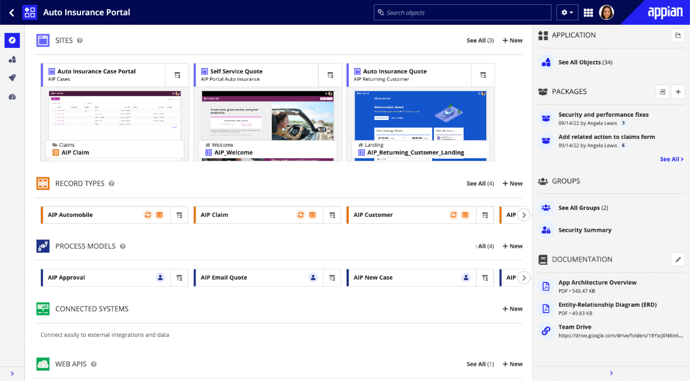

	-  

#### AppSmith

- [AppSmith Platform](https://www.appsmith.com/)

- Core features: 
	- Open-Source Low-Code Platform for internal tool development for business
	- Drag and Drop interface: Appsmith provides many types of interface components, interactive elements: Form, JSON form, Input, Rich Text Editor, Currency Input, Phone Input,... This allows non-technical users easily to create the front-end of applications, dashboards, ...
	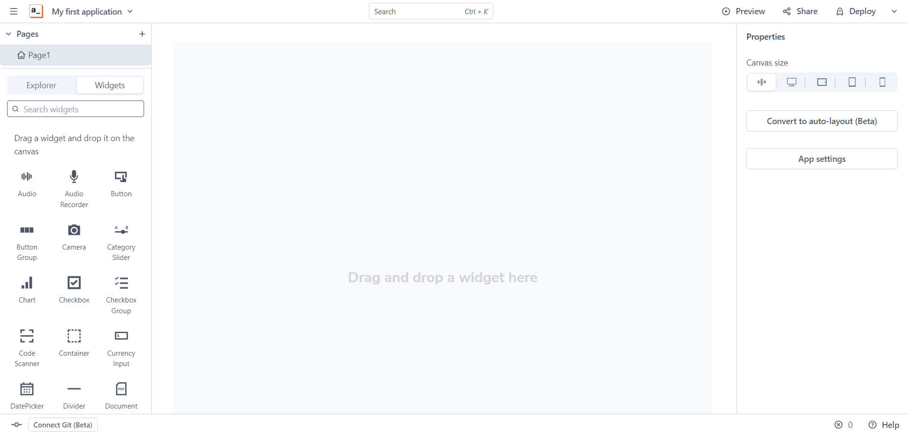
	- Support connection to many datasources, from API, Databases, ...with friendly query builders
	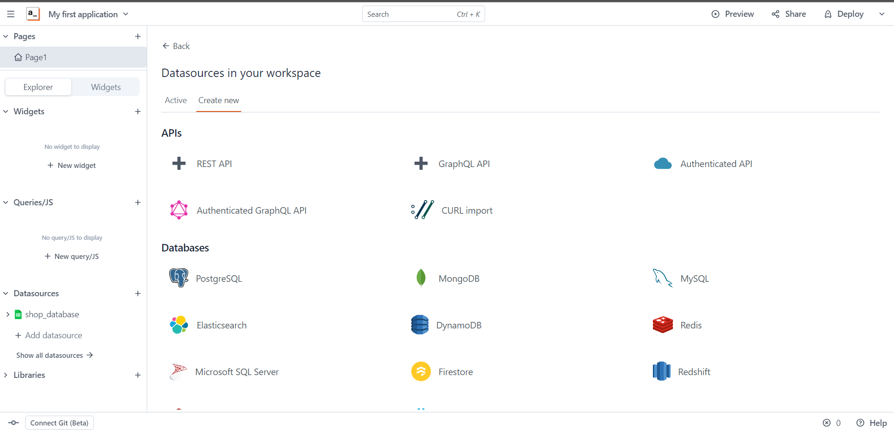
	- LowCode: Appsmith allows user using JavaScript to customize the way data rendered into UI and retrieved from datasources, or event listeners
	- Appsmith provides many pre-built templates: crm, analytics dashboard
	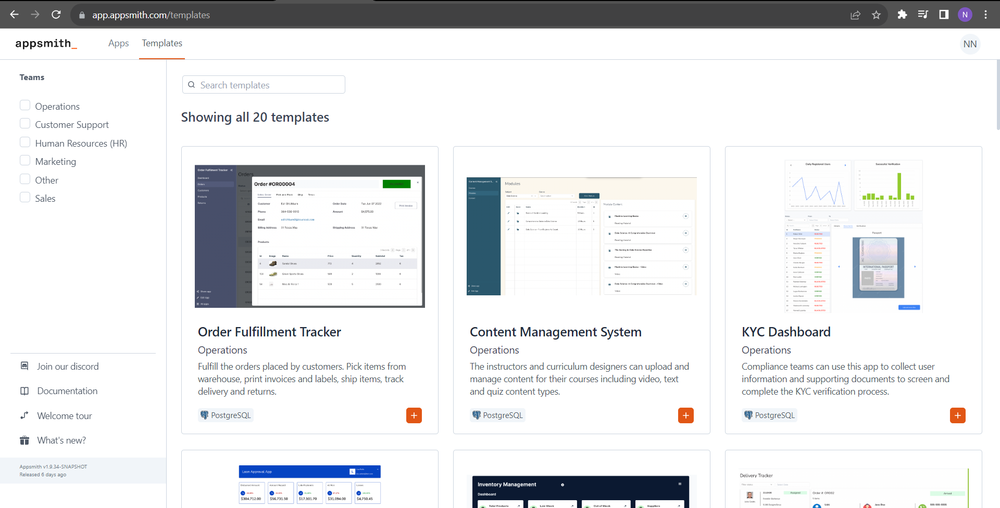
	- Security: role-based access control, data encryption, and user authentication, third-party identity providers like OAuth
- Problems:
	- Besides datasources supported, it is hard for users to add new components or other third-party datasources
	- Take time and effort to familiarize yourself with the concepts and syntax specific to Appsmith.

#### Tooljet
- [Tooljet Platform](https://www.tooljet.com/)
- Core features:
	- Tooljet is also an open-source low-code platform internal tool development for business
	- Drag and Drop interface: support custom components with React[5](https://docs.tooljet.com/docs/widgets/custom-component)
	- Tooljet offers a wider range of integrations with third-party services, databases when comparing with Appsmith
	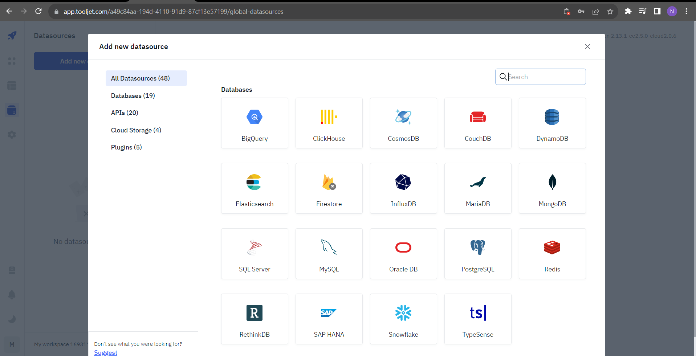
	- Toojet database, Python support

#### Mendix

#### Microsoft Power Apps

#### IBM Cloud Pak for Automation

- [IBM Business Automation Workflow](https://www.ibm.com/products/business-automation-workflow?lnk=flatitem)

- Core features
	- **Low-code Drag-and-drop interface for building application**:

	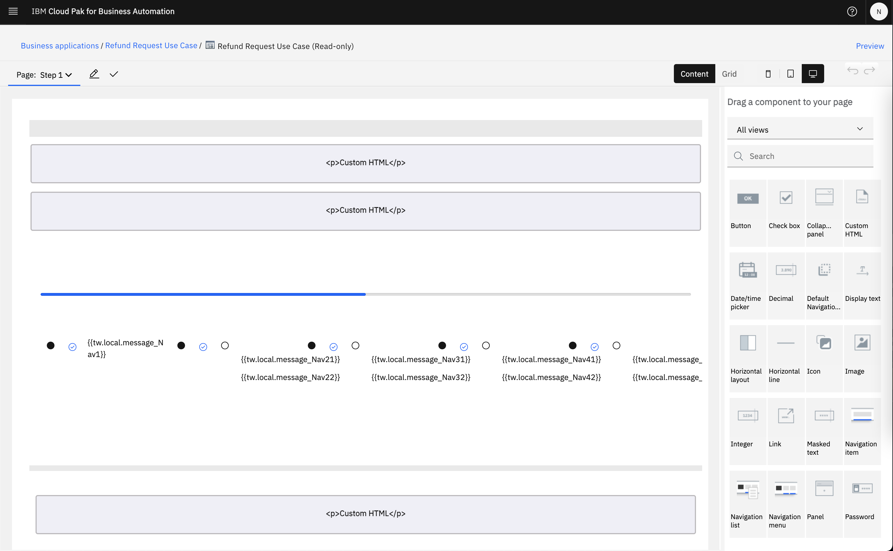

	- **Designed for general purpose**:

	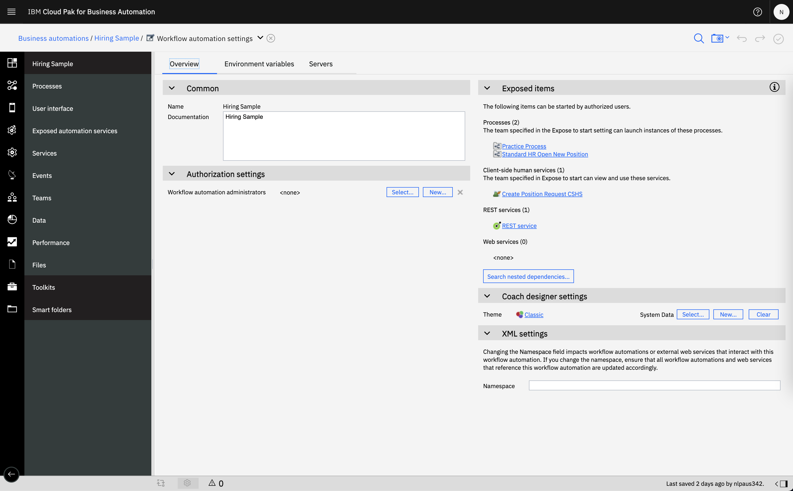

	- **Support flow-graph tool**: 

	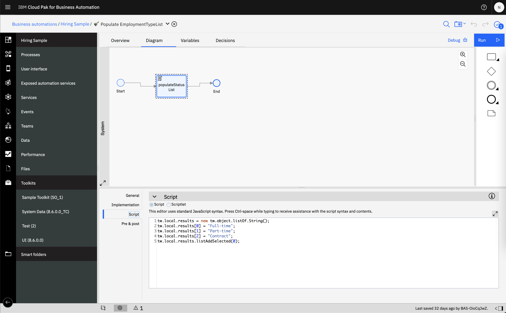

- Problems:
	- Require business users to develop from scratch to serve the specific use-case requirements.
	- Learning curve might be too high for business users.

- What the project aims to solve:
	- Provide a low-code platform that is designed for a specific use-case: Promotion campaign automation.
	- Provide a low-code platform that is easy to use for business users.
	- A flexible, self-hosted standalone platform that can be integrated with other services and not tied to a specific cloud provider.

## References