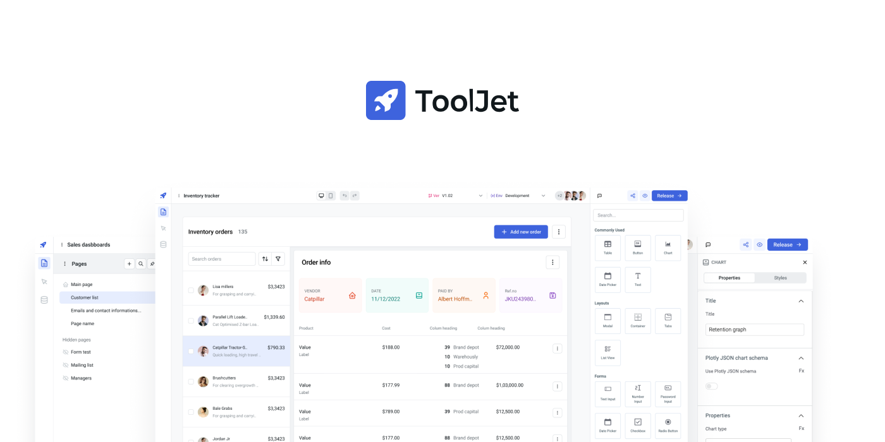

# Existing Low-code Development Platforms Comparion
Low-code Developing is slowly becoming a thing in business environment. And to keep up with the demand, many low-code development platforms have been provided for the business users with a large variety of usage and pricing. Yet, we would like to introduce 3 platforms that we consider the most notable ones. We are going to categorize them into 3 groups:
- Open-source
- Propiertary, free-to-use
- Propiertary, paid

## Open-source
Our candidate for this category is going to be **[ToolJet](https://github.com/ToolJet/ToolJet)**. ToolJet is an open-source low-code framework to build and deploy internal tools with minimal engineering effort. ToolJet's drag and drop frontend builder allows you to create complex, responsive frontends within minutes. Additionally, you can integrate various data sources, including databases like PostgreSQL, MongoDB, and Elasticsearch; API endpoints with OpenAPI spec and OAuth2 support; SaaS tools such as Stripe, Slack, Google Sheets, Airtable, and Notion; as well as object storage services like S3, GCS, and Minio, to fetch and write data.

### Pros
- Visual Drag-n-Drop App Builder
  - ToolJet provides a drag-n-drop app builder with a variety of prebuilt resizable components that are ready to use. Each component has its own event handler to trigger an action which is also predefined in the application.
- Database:
  - With ToolJet, you can either use its own ToolJet Database or integrate with an existing data sources. ToolJet can support integration with over 40 different data sources, including SQL, MongoDB, FireStore, InfluxDB, MariaDB or even RESTful API.
- Collaboration:
  - An app can be edited and customized by multiple users simultaneously with ToolJet's Multiplayer editing.
- Version Control:
  - Users can manage multiple application versions with a structured release cycle.
- Customization:
  - If prebuilt scripts and components are not sufficent, users can implement their own JavaScript and Python code into the application.
## Cons
- Confusing User Experience:
  - Although the drag-n-drop interface provides a decent amount of prebuilt components, interacting with them is not a good experience for newcomers. Moving a component around the canvas can easily trigger an inner component of the component itself. The user will also has no clue how the final page will look like since the canvas only contains components. There is no border or boundary for the user to identify where the component is going to get positioned on the product.
  - Components can overlap each other and there is no way to get a component to get on top. For example, if a button component is placed inside of a table component, the moment you hover on the table, it will overlap the button and you will not be able to ever select the button unless you move a table to another position. This might be a feature indicating that components should not overlap each other but ToolJet could have done it in a better way.
- High loading time for previewing:
  - It took around 1 to 2 seconds in order to load the preview for the application, which is fine but the way the preview loaded is confusing since initially what you get is a blank page with a page navigation column on the left. There is no indication that the page is still loading and might give the users the feeling of something has gone wrong during the loading process.
- Lack of workflow management:
  - Any features related to workflow are nowhere to be found in the main interface. Despite the fact that ToolJet does have a workflow editor, it is still in a beta phase and only available for paid plans.