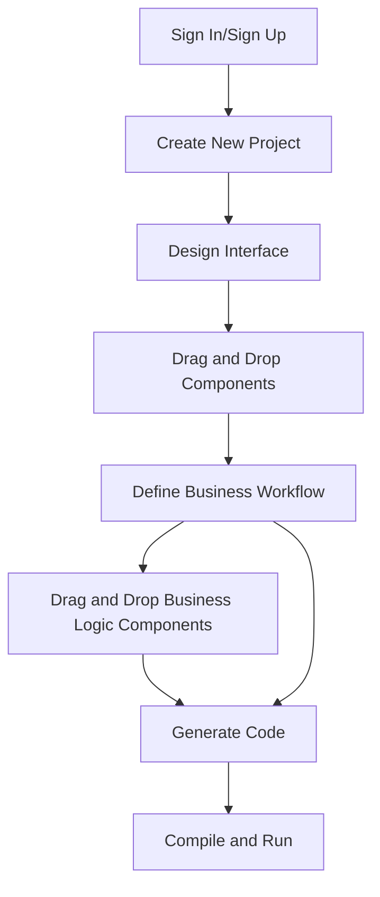
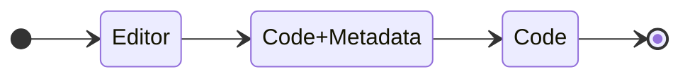
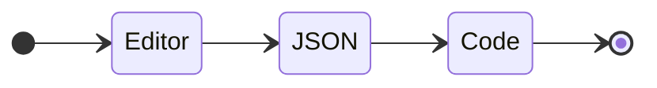
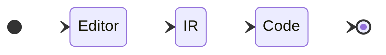

# System Design

##  Requirements

### In scope
- Users should be able to create and edit web applications using a visual drag and drop interface.
- Users should be able to define the business logic of their application using a visual interface.
- Code-based customization options should be available for each element in the visual interface.
- Users should be able to generate code from the platform and compile and run it.

### Out of scope
- Users should be able to debug their application using the platform.
- Users should be able to import code into the platform and be able to work on it.


## Architectural Overview

### Basic User Flow



### Internal Architecture

There are three main approach to implement the internal architecture of the platform:
- Editor -> Code + Metadata -> Code
- Editor -> JSON -> Code
- Editor -> Intermediate Representation -> Code

#### Editor -> Code + Metadata -> Code


This approach involves the use of an editor to create code and associated metadata which is then converted back to code. This is a common approach used in low-code platforms, particularly for developers who understand the technical specifications and side effects of modifications.

Limitations of this approach include issues with drag and drop functionality, CSS inheritance issues, inability to import code, and the requirement of adding custom attributes to the markup for the functionality of the editor.

- Example pseudo-code:
```javascript
const editor = new Editor();
const elem = editor.create('div');
elem.style.set('position', 'absolute');
elem.meta.set('info', 'This is a draggable element');
editor.render(elem);
```

#### Editor -> JSON -> Code



In this approach, the editor generates a JSON representation of the application, which is then converted into code. This approach can be useful for building applications that require a high level of customization, making it a popular choice for low-code platforms.

The JSON representation can include information about the application's structure, its components, and their properties. The generated code can then be executed to run the application.

- Example JSON schema:
```json
{
  "type": "object",
  "properties": {
    "name": {
      "type": "string"
    },
    "age": {
      "type": "integer"
    },
    "pets": {
      "type": "array",
      "items": {
        "type": "string"
      }
    }
  }
}
```

#### Editor -> Intermediate Representation -> Code



This approach involves the use of an editor to create intermediate components, which are then converted into code. These components can be visual elements, logic elements, or a combination of both. This approach allows for a high level of abstraction, making it easier for developers to build complex applications without having to write a lot of code.

The intermediate components serve as a bridge between the visual interface provided by the editor and the underlying code that powers the application. They encapsulate certain functionalities and can be reused across different parts of the application.

```jsx
import { Button, Form, Input } from 'antd';

const FormItem = Form.Item;

const CustomForm = () => (
  <Form>
    <FormItem label="Name">
      <Input placeholder="Enter your name" />
    </FormItem>
    <FormItem>
      <Button type="primary">Submit</Button>
    </FormItem>
  </Form>
);

```
