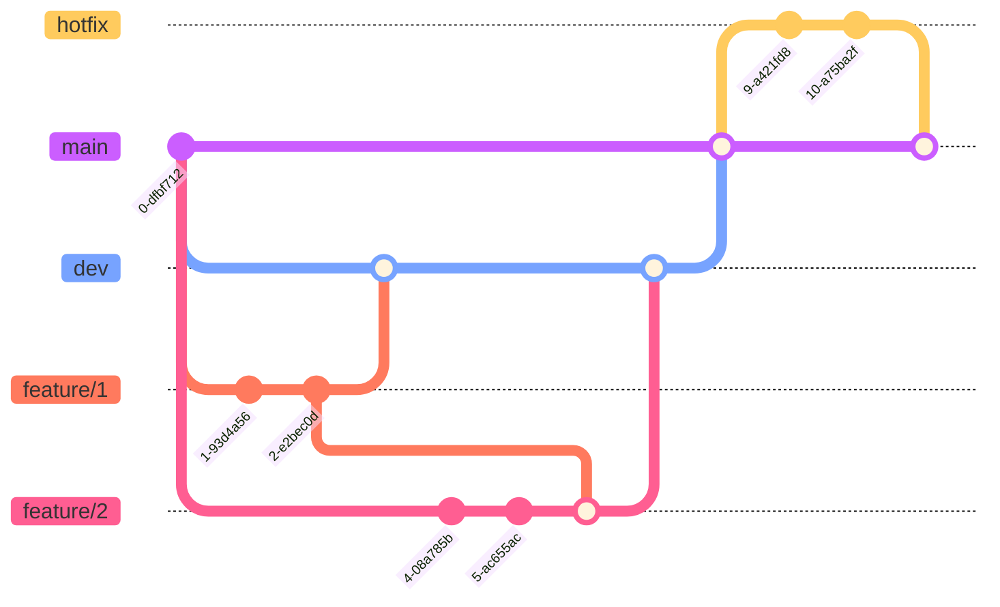

# Working Way

## Table of Contents

1. [Git braching model](#git-branching-model)
2. [Project management](#project-management)
3. [Documentation](#documentation)

## Git branching model

- **Main branch**: `main` - The main branch is the branch where the source code of HEAD always reflects a production-ready state.

- **Development branch**: `dev` - The development branch is the branch where the source code of HEAD always reflects a state with the latest delivered development changes for the next release. Some would call this the “integration branch”. This is where any automatic nightly builds are built from.

- **Feature branch**: `feature/1` - Feature branches (or sometimes called topic branches) are used to develop new features for the upcoming or a distant future release. When starting development of a feature, the target release in which this feature will be incorporated may well be unknown at that point. The essence of a feature branch is that it exists as long as the feature is in development, but will eventually be merged back into develop (to definitely add the new feature to the upcoming release) or discarded (in case of a disappointing experiment).

- **Hotfix branch**: `hotfix` - Hotfix branches are very much like release branches in that they are also meant to prepare for a new production release, albeit unplanned. They arise from the necessity to act immediately upon an undesired state of a live production version. When a critical bug in a production version must be resolved immediately, a hotfix branch may be branched off from the corresponding tag on the master branch that marks the production version.

## Project management

- **Project management tool**: [Github Project](https://github.com/users/nguyendhst/projects/1)

- **Project management methodology**: [Agile](https://www.atlassian.com/agile/project-management/epics-stories-themes)

- **Project management process**: [Scrum](https://www.atlassian.com/agile/scrum)

## Documentation

- **Documentation tool**: [Markdown](https://www.markdownguide.org/basic-syntax/)

- **Technical Approach**: Technical approach is a document that describes the technical approach or strategy to be used to address a particular technical problem. It is a document that outlines the steps or tasks that will be required to accomplish the goals of the project. 

