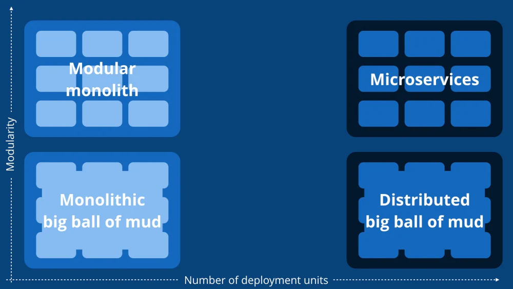

# System Design

***

- [High-level architecture of the low-code platform](#high-level-architecture)
- [Explanation of the chosen architectural style](#architectural-style)
- Description of the key components and their interactions
- Detailed design of each microservice and its responsibilities
- Data model design and database schema

***

## High-Level Architecture

### Activity Diagram
### Architectural Style

Arcchitecture style is the fundamental structural design of a software system. It consists of a set of patterns and principles used to define the system's components, their interactions, and the constraints that guide their design and evolution. [1](https://en.wikipedia.org/wiki/Software_architecture)

#### Comparison of architectural styles

**Layered Architecture**

The layered architecture style is a hierarchical design pattern often used in software applications. It breaks apart the application into different functional layers, each providing services to the layer above it [2](https://www.baeldung.com/cs/layered-architecture).

*Advantages:*
- High level of abstraction which simplifies development and maintenance.
- Changes in one layer have minimal impact on other layers, promoting isolation and reducing dependencies.
- Promotes separation of concerns, where each layer focuses on a specific function [3](https://www.baeldung.com/cs/layered-architecture).

*Disadvantages:*
- Overhead and potential performance degradation due to the need for data to pass through multiple layers.
- The design can be rigid and may not be suitable for applications requiring high levels of scalability or flexibility.
- Can lead to "fat" layers if not carefully managed, where a layer takes on too many responsibilities [4](https://www.baeldung.com/cs/layered-architecture).

**Pipeline Architecture**

Pipeline architecture is a design pattern where data flows through several stages or steps to complete a process. Each stage operates concurrently, and the output of one stage is the input to the next.

*Advantages:*
- Efficient for large volumes of data and complex processing tasks, as data moves through stages concurrently.
- Each stage is independent and can be modified or replaced without affecting others.
- Enables high throughput and processing speed, especially in systems with parallel processing capabilities.

*Disadvantages:*
- Can be complex to design and manage, particularly for complex tasks requiring many stages.
- Performance is limited by the slowest stage in the pipeline.
- If a stage fails, it can disrupt the entire process.

**Microkernel Architecture**

Microkernel architecture is a design pattern where the kernel (core of the operating system) provides only basic services such as inter-process communication, basic scheduling, and basic I/O handling. All other services run as independent processes in user space, communicating with the kernel and each other as necessary [5](https://www.geeksforgeeks.org/microkernel-in-operating-systems/), [6](https://www.guru99.com/microkernel-in-operating-systems.html).

*Advantages:*
- Enhances the reliability and security of the system. If a user-level process fails, it does not affect the kernel or other processes [7](https://www.linkedin.com/advice/3/what-benefits-drawbacks-using-microkernel-architecture).
- Enables modularity and flexibility, as services can be added, removed or replaced without affecting the kernel [8](https://www.geeksforgeeks.org/microkernel-in-operating-systems/).

*Disadvantages:*
- Performance can be slower due to the overhead of inter-process communication.
- The design can lead to increased complexity, making it more challenging to develop and maintain [9](https://www.linkedin.com/advice/3/what-benefits-drawbacks-using-microkernel-architecture).

**Service-Based Architecture**

A Service-Based Architecture (SBA) is a type of architecture where services are the primary architectural components. The services are built on the concept of sharing as much as possible. For example, in a large retail company that has many applications associated with the processing of an order, SOA tries to address this problem through enterprise-level shared services (enterprise services). The Order service is smart enough to know which database to go to retrieve and update order data for each system, at the same time synchronizing the data among all three systems [1](https://www.oreilly.com/radar/microservices-vs-service-oriented-architecture/).

*Advantages*

- **Component Sharing**: SBA promotes the sharing of components across the enterprise, increasing scalability and efficiency [1](https://www.ibm.com/blog/soa-vs-microservices/).
- **Service Availability and Responsiveness**: SBA addresses service availability (the ability of a remote service to accept requests in a timely manner) and service responsiveness (the ability of the service consumer to receive a timely response from the service) [1](https://www.oreilly.com/radar/microservices-vs-service-oriented-architecture/).

*Disadvantages*

- **Complexity**: SBA can be complex and might not be needed for all types of applications. It might be a good choice for larger, more diverse environments but less so for smaller environments like web and mobile applications [1](https://www.ibm.com/blog/soa-vs-microservices/).
- **Coordination**: There might be a need for coordination among services to fulfill a single business request, which can increase development, testing, deployment, and maintenance time [1](https://www.oreilly.com/radar/microservices-vs-service-oriented-architecture/).

**Event-Driven Architecture**

Event-Driven Architecture (EDA) uses a publish-subscribe (pub-sub) model, where producers publish events, and consumers subscribe to them. The producers are independent of the consumers, and consumers are independent of each other. It is useful when different subsystems must perform different types of processing on the same event data [1](https://learn.microsoft.com/en-us/azure/architecture/guide/architecture-styles/).

*Advantages*

- Decoupling: In EDA, the producers and consumers are decoupled, which allows them to be scaled, updated, and deployed independently [1](https://aws.amazon.com/event-driven-architecture/).
- Fault Tolerance: Since services are decoupled from each other in EDA, faults are isolated to individual services. If a subscribing service fails, it doesn't impact the service that sent the event. Communications are queued in a broker until the subscriber is repaired or replaced [1](https://www.techtarget.com/searchapparchitecture/tip/Event-driven-architecture-pros-and-cons-Is-EDA-worth-it).
- Real-Time Processing and Responsiveness: EDA enables real-time processing and responsiveness by reacting to events as they occur. It ensures that the system can respond quickly to changes, enabling faster decision-making, real-time analytics, and immediate action [1](https://www.confluent.io/learn/event-driven-architecture/).

*Disadvantages*

- Difficulties with Monitoring: Since the services are independent of each other, you need a proper design to understand how they interact with each other and also a proper alerting mechanism to understand the knock-on effect should a service fail [1](https://solace.com/blog/event-driven-architecture-pros-and-cons/)
- Complexity: EDA can be complex to implement and manage. It requires a different programming model that may be unfamiliar to developers who are used to request-response models [1](https://dev.to/aws-builders/event-driven-vs-workflows-a-comprehensive-comparison-for-developers-and-architects-2j9k).

**Space-Based Architecture**

Space-Based Architecture (SBA) is a software design approach that organizes the system around the concept of "spaces", which are essentially isolated and autonomous units of functionality. Each space has its own data, logic, and interface, and they communicate with each other through message passing[1](https://dev.to/alexr/software-architecture-patterns-space-based-architecture-h2i).

*Advantages*

- **Isolation and Autonomy**: SBA promotes a high degree of isolation and autonomy, making it easier to test, deploy, and evolve the system. Since each space is independent, it can be developed, tested, and deployed separately, allowing developers to work on different spaces concurrently [1](https://dev.to/alexr/software-architecture-patterns-space-based-architecture-h2i).
- **Scalability and Performance**: SBA allows for easy handling of scalability and performance. Because each space is isolated and can be scaled separately, it allows for better control of the resources used by the system [1](https://dev.to/alexr/software-architecture-patterns-space-based-architecture-h2i).

*Disadvantages*

- **Complexity**: SBA requires careful planning and coordination and can add complexity to the system. This complexity can increase the difficulty of development and maintenance [1](https://dev.to/alexr/software-architecture-patterns-space-based-architecture-h2i).

**Microservices Architecture**

A Microservices Architecture is an architectural method that relies on a series of independently deployable services. These services have their own business logic and database with a specific goal. Updating, testing, deployment, and scaling occur within each service. Microservices don't reduce complexity, but they make any complexity visible and more manageable by separating tasks into smaller processes that function independently of each other [1](https://www.atlassian.com/microservices/microservices-architecture/microservices-vs-monolith).

*Advantages*

- **Independent Deployment**: Microservices can be deployed independently, allowing developers to update or fix issues in one service without affecting the others [1](https://www.atlassian.com/microservices/microservices-architecture/microservices-vs-monolith).
- **Scalability**: Each microservice can be scaled independently based on its specific needs, which leads to better resource utilization [1](https://stackify.com/6-key-benefits-of-microservices-architecture/).
- **Technology Diversity**: In a microservices architecture, each service can be built using the technology stack that best suits its requirements. This allows developers to choose the most suitable technologies for each service [1](https://about.gitlab.com/blog/2022/09/29/what-are-the-benefits-of-a-microservices-architecture/).

*Disadvantages*

- **Increased Complexity**: Microservices can add increased complexity that leads to development sprawl, or rapid and unmanaged growth. It can be challenging to determine how different components relate to each other [1](https://www.atlassian.com/microservices/microservices-architecture/microservices-vs-monolith).
- **Debugging Challenges**: Each microservice has its own set of logs, which makes debugging more complicated. A single business process can run across multiple machines, further complicating debugging [1](https://www.atlassian.com/microservices/microservices-architecture/microservices-vs-monolith).

#### Chosen architectural style

For a low-code platform that includes a web-based user interface for modeling applications, defining business logic, and deploying web applications. There are several prolems that need to be addressed:

- Performance: The platform should be able to handle a large number of users and applications.
- Scalability: The platform should be able to scale up and down based on demand since a common runtime environment is used for all applications.
- Many core functionalities:
	- Data Management
	- Business Logic Execution
	- Application Deployment

Using a **microservices architecture**, we can address these problems by breaking down the platform into smaller, more manageable services. Each service can be developed, tested, and deployed independently, allowing for better control of the resources used by the system. This also allows for easier handling of scalability and performance, as each service can be scaled separately.

However, this can add more complexity to the development process:
- Communication between services can be challenging to manage.
- It can be challenging to determine how different components relate to each other.
- Each microservice has its own set of logs, which makes debugging more complicated.

Instead, to better manage the complexity of the system, we can use a **modular monolith architecture**. This architecture allows us to break down the system into smaller modules, each responsible for a specific feature or functionality. These modules can be developed, tested, and deployed independently, allowing for better control of the resources used by the system. This also allows for easier handling of scalability and performance, as each module can be scaled separately.

**Modular Monolith Architecture:**[10](https://shopify.engineering/deconstructing-monolith-designing-software-maximizes-developer-productivity)

- Implement the server-side application as a single unit (monolith), but the codebase is organized into several modules. 
- Each module is responsible for a specific feature or functionality, and modules interact with each other through well-defined interfaces.
- Clean Architecture can be used to define the structure of the application.

**Stateless Client-Server Architecture:**

- Implement a stateless client-server architecture where the server does not store any client state.
- Utilize a client-server architectural pattern where the web-based user interface (web browser client) communicates with the server-side components.
- The client interface allows users to model applications, define business logic, and interact with the platform.
- The server-side components handle the storage, retrieval, and execution of user-defined models and application logic.
- Benefits: Separation of concerns, easier user interaction, and centralized management of data and logic.

### Key Components

### Architecture Diagrams

#### System Context Diagram
#### Container Diagram
#### Component Diagram
#### Deployment Diagram
